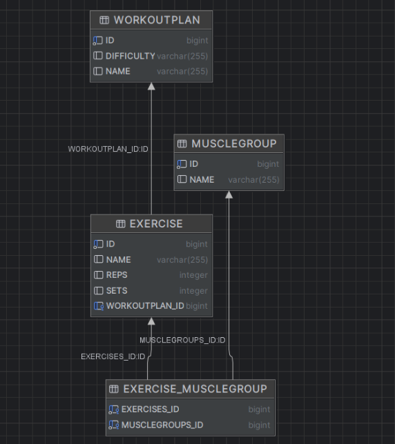
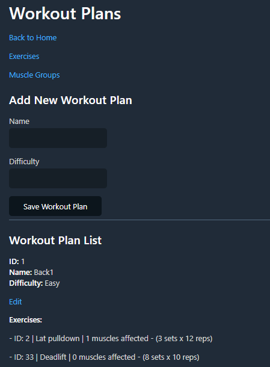
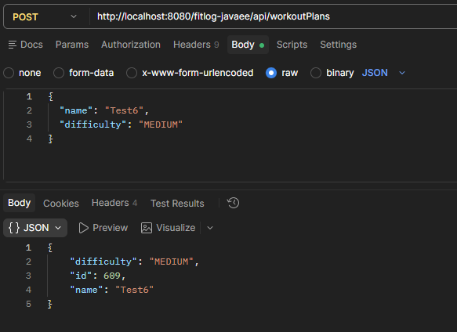

# FitLog – Workout Management System (Java EE)

FitLog is a backend-focused workout management system built with Java EE.
The goal of this project is to demonstrate enterprise-level backend concepts such as REST API design, ORM vs SQL mapping, dependency injection, and asynchronous processing.

---

## Features

* Create and manage workout plans
* Assign exercises and muscle groups
* REST API for CRUD operations
* Asynchronous background processing with progress tracking
* Multiple data access strategies (JPA and MyBatis)
* Use of CDI (Contexts and Dependency Injection)
* Interceptors and decorators for clean architecture

---

## Tech Stack

* Java EE (Jakarta EE)
* Maven
* REST (JAX-RS)
* JPA (Hibernate)
* MyBatis
* CDI (Dependency Injection)
* PostgreSQL (configurable)
* JSF (basic UI)

---

## Project Structure

```
src/main/java/lt/vu/fitlog/
├── beans/          # JSF/CDI managed beans (use cases)
├── dao/            # Data access layer (JPA and MyBatis)
├── entities/       # JPA entities (WorkoutPlan, Exercise, MuscleGroup)
├── interceptors/   # Logging / cross-cutting concerns
├── decorators/     # DAO behavior extensions
├── rest/           # REST API endpoints
├── services/       # Business logic (async jobs, calculations)
```

---

## REST API

### Example Endpoints

#### Get all workout plans

```
GET /api/workoutPlans
```

#### Create a workout plan

```
POST /api/workoutPlans
Content-Type: application/json

{
  "name": "Leg Day",
  "description": "Focus on quads and glutes"
}
```

#### Update workout plan

```
PUT /api/workoutPlans/{id}
```

#### Delete workout plan

```
DELETE /api/workoutPlans/{id}
```

---

## Asynchronous Processing

The system includes a background task mechanism that simulates long-running operations.

* Runs in a separate thread
* Tracks progress over time
* UI can poll and display progress updates

Example use cases:

* Calculating workout statistics
* Simulating heavy backend processing

---

## Data Access: JPA vs MyBatis

This project demonstrates two different approaches to data access:

### JPA (ORM)

* Entity-based
* Automatic mapping between objects and database tables
* Faster development, less SQL

### MyBatis (Data Mapper)

* SQL-based control
* More flexible and explicit queries
* Better for complex queries

This allows comparison of abstraction vs control in real-world scenarios.

---

## CDI, Interceptors and Decorators

### CDI (Dependency Injection)

* Managed beans using scopes:

    * `@RequestScoped`
    * `@SessionScoped`
    * `@ApplicationScoped`

### Interceptors

* Used for logging method calls
* Separates cross-cutting concerns from business logic

### Decorators

* Extend DAO behavior without modifying original implementation
* Example: logging or validation around persistence operations

---

## Key Concepts Demonstrated

* Layered architecture (Presentation → Business → Data)
* RESTful API design
* ORM vs Data Mapper patterns
* Asynchronous backend processing
* Dependency injection (CDI)
* Separation of concerns using interceptors and decorators

---

## Running the Project

### Requirements

* Java 17 or higher
* Maven
* Application server (e.g. WildFly)

### Steps

```
mvn clean install
```

Deploy the generated `.war` file to your application server.

---

## Screenshots

* DB


* Workout plan UI


* API testing (e.g. Postman)

* 
---

## Notes

This project was developed as part of a university assignment, with a focus on exploring enterprise Java features and architectural patterns.

---

## Future Improvements

* Add modern frontend (e.g. Angular or React)
* Improve UI/UX
* Add authentication and authorization
* Replace simulated async jobs with real analytics
* Containerize the application (e.g. Docker)
