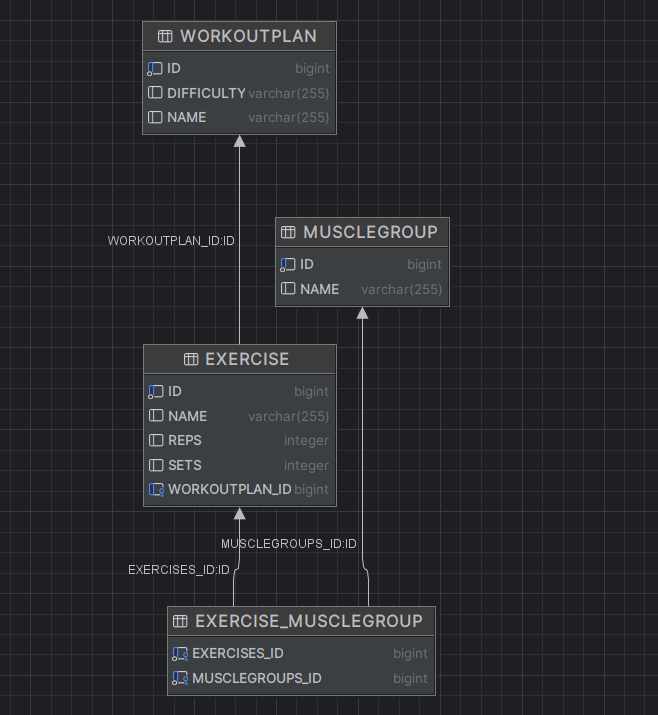

# FitLog – Java EE Gym Workout Tracker

FitLog is a university project built with Java EE that allows users to create and manage gym workout plans, exercises, and muscle groups.

The application demonstrates both ORM (JPA) and DataMapper (MyBatis) approaches for working with a relational database.

---

## Features

- Create workout plans
- Add exercises to workout plans
- Assign muscle groups to exercises
- View related data (e.g., workout plans with exercises, exercises with muscle groups)
- Data persistence across server restarts
- MyBatis-based exercise management (in addition to JPA)

---

## Technologies Used

- Java EE (Jakarta EE)
- JSF (JavaServer Faces)
- CDI (Contexts and Dependency Injection)
- JPA (Hibernate) – ORM
- MyBatis – DataMapper
- Maven
- WildFly 26
- H2 Database (file-based)

---

## Architecture Overview

- **UI (JSF)** – forms and pages for user interaction
- **CDI Use Case Beans** – handle business logic and data flow
- **JPA DAO Layer** – database access using ORM
- **MyBatis Mapper Layer** – database access using SQL
- **H2 Database** – local file-based persistence

---

## Database

- Configured via WildFly datasource (`FitLogDS`)
- Uses H2 file-based database
- Data persists after full server restart
- Tables are generated automatically via JPA (`hibernate.hbm2ddl.auto=update`)

---

## Purpose

This project was developed as part of a university assignment to demonstrate:

- ORM vs DataMapper approaches
- Entity relationships (one-to-many, many-to-many)
- Data binding and UI interaction
- CDI and layered architecture

---

## How the big MyBatis query is used

UI exercises.xhtml
→
Use case Exercises.java
→
DAO interface ExerciseDAO
→
active implementation ExerciseDAOMyBatis
→
mapper method ExerciseMapper.selectAllWithGraph()
→
XML mapper ExerciseMapper.xml
→
SQL with joins runs on DB
→
MyBatis maps rows to objects Exercise + WorkoutPlan + MuscleGroups
→
objects returned back to UI

---

## DB

## `Count visit` - a button for scopes demo
- HomePage is the bean connected to the UI
- it uses @Inject to get DemoCounter
- DemoCounter is an independent CDI component
- With @RequestScoped - counter resets every request, instanceId changes constantly (always 0)
- With @SessionScoped, its state is kept during one user session - that is why the count stays even after page reload
- With @ApplicationScoped - one bean for whole application, value would be shared globally

## Test REST API
- Deploy/run your project on WildFly
- GET - http://localhost:8080/fitlog-javaee/api/workoutPlans/1
- 